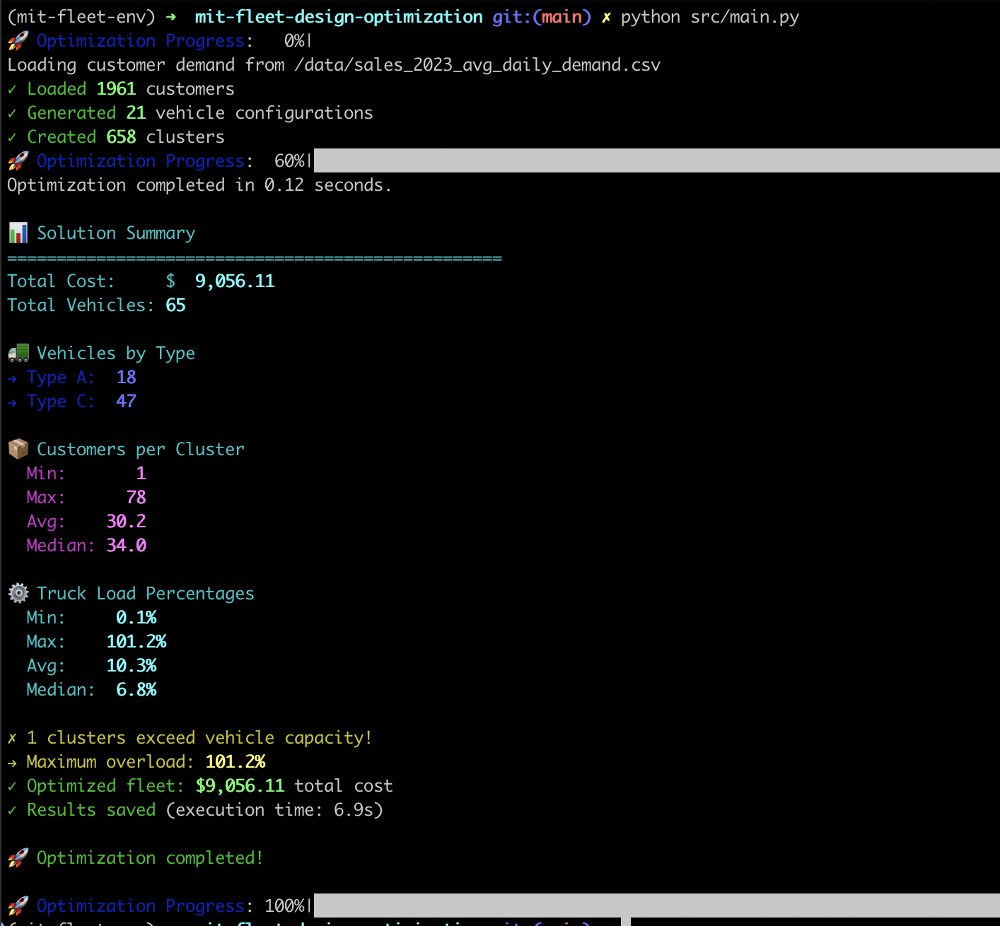

# MIT Fleet Design Optimization

The project implements a multi-step strategy to solve the Fleet Size and Mix (FSM) problem for Multi-Compartment Vehicles (MCVs). To test our solution appoach, we use case study data from a large food distribution company.

## Methodology

The optimization pipeline follows these steps:

1. Data Processing
   - Load customer demand data
   - Generate feasible vehicle configurations
   - Process geographic and demand constraints

2. Clustering
   - Group customers based on location and demand patterns
   - Consider vehicle capacities and time constraints
   - Use parallel processing for efficient cluster generation

3. Fleet Size and Mix Optimization
   - Minimize total cost (fixed + variable)
   - Ensure all customers are served
   - Respect vehicle and compartment capacities
   - Determine optimal number and type of vehicles

4. Solution Validation and Results Export
   - Validate solution feasibility
   - Generate comprehensive reports

## Project Structure

```
mit-fleet-design-optimization/
├── data/
│   ├── export_avg_daily_demand.sql
│   ├── avg_daily_demand__2023_09.sql
│   ├── import.py                      # Creates a DB with sales data
│   ├── export_queries.py              # Generates csv files for each db query
│   └── sales_2023_create_data.sql
├── src/
│   ├── main.py                     # Principal execution script
│   ├── clustering.py               # Customer clustering implementation
│   ├── fsm_optimizer.py            # Fleet Size and Mix optimization
│   ├── clustering_playground.py    # Clustering experiments
│   ├── column_generation_playground.py
│   ├── config/
│   │   └── default_config.yaml    # Default configuration parameters
│   └── utils/
│       ├── data_processing.py
│       ├── logging.py
│       ├── save_results.py
│       └── vehicle_configurations.py
├── results/                       # Optimization results storage
├── tests/
├── init.sh
├── requirements.txt
└── README.md
```

## Directory Structure Details

### Data Directory
The data directory contains utilities to process raw sales data into formats suitable for the optimization algorithm:

- `export_queries.py`: A module that handles SQL query execution and CSV exports. 
- `import.py`: Creates and populates a SQLite database (opperar.db) with sales data
- `sales_2023_create_data.sql`: SQL script to create and populate the sales database

### Source Directory (src/)
- `main.py`: Principal execution script that runs the complete optimization pipeline
- `clustering.py`: Implements customer clustering algorithms with capacity and time constraints
- `fsm_optimizer.py`: Fleet Size and Mix optimization using integer programming
- `clustering_playground.py`: Experimental clustering implementations
- `column_generation_playground.py`: Column generation algorithm experiments
- `config/`: Configuration files and parameters
- `utils/`: Helper modules for data processing, logging, and result management

### Results Directory
The results directory stores the output of each optimization execution:
- Excel files (.xlsx) containing:
  - Solution summary
  - Vehicle configurations
  - Selected clusters
  - Vehicle usage statistics
  - Other considerations
  - Execution details
- JSON files for programmatic access to the results

### Tests Directory
Contains test files for the project modules

### TODO
- Implement demand forecasting functionality
- Add forecasting models and results storage

## Requirements

### Installation Steps

1. Initialize the project environment:
```bash
./init.sh
```

This script will:
- Create a Python virtual environment
- Install required dependencies
- Create and populate the SQLite database with sales data from 2023
- Generate initial customer demand data files

2. Activate the Python environment:

For Mac/Linux:
```bash
source mit-fleet-env/bin/activate
```

For Windows:
```bash
mit-fleet-env\Scripts\activate
```

## Running the Optimization

To run the fleet optimization pipeline:
```bash
python src/main.py
```



## License

This project is licensed under the MIT License.