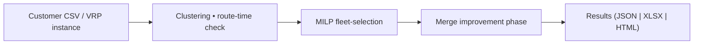

# fleetmix — Fleet Size & Mix Optimizer for Multi‑Compartment Fleets

*Written for transparent research, hardened for production use.*

Fast, reproducible tooling for **multi‑compartment vehicle fleet design** in urban food distribution. This repository supports our forthcoming paper *Designing Multi‑Compartment Vehicle Fleets for Last‑Mile Food Distribution Systems* and doubles as a production‑grade library for industry users.

---

## Why fleetmix ?

* **Scales** — >1 000 customers solved in seconds via a *cluster‑first → MILP‑second* matheuristic.
* **Extensible** — pluggable clustering engines, route‑time estimators, and solver back‑ends.
* **Reproducible** — every experiment in the journal article reruns with one script.

---

## Table of Contents

1. [Quick Start](#quick-start)
2. [Architecture Overview](#architecture-overview)
3. [Command‑Line Usage](#command-line-usage)
4. [Benchmarking Suite](#benchmarking-suite)
5. [Library API](#library-api)
6. [Repository Layout](#repository-layout)
7. [Paper ↔ Code Map](#paper-↔-code-map)
8. [Contributing](#contributing)
9. [Citation](#citation)
10. [License](#license)

---

## Quick Start

```bash
# 1 · clone & setup environment (virtualenv, dependencies, data import)
git clone https://github.com/ekohan/fleetmix.git && cd fleetmix
./init.sh

# Install the package in editable mode
pip install -e .

# 2 · run smoke example (tiny 2-customer CSV)
python -m fleetmix.cli.main \
       --demand-file tests/_assets/smoke/mini_demand.csv \
       --config tests/_assets/smoke/mini.yaml
```

> **TODO**: bundle a richer sample dataset and a one-liner `fleetmix demo`.

---

## Architecture Overview



*Full algorithmic details are in §4 of the paper.*

---

## Command‑Line Usage

### Optimise a fleet

```bash
python -m fleetmix.cli.main --help          # full parameter list
python -m fleetmix.cli.main \               # typical run
  --demand-file data/bogota_2024.csv \      # CSV with customer demand
  --config configs/bogota.yaml \            # YAML holds most parameters
  --avg-speed 35 \                          # example CLI override
  --verbose
```

### Convert VRP benchmarks → FSM format

```bash
python -m fleetmix.cli.vrp_to_fsm \
       --vrp-type cvrp --instance X-n101-k25 --benchmark-type split
```

### Reproduce all paper experiments (Henke & Uchoa sets)
  
```bash
python -m fleetmix.cli.run_all_mcvrp                # 153 MCVRP instances
python -m fleetmix.cli.run_all_cvrp                 # TODO: selected CVRP adaptations
python -m fleetmix.cli.run_upper_and_lower_bounds   # TODO: bounds check
```

---

## Benchmarking Suite

Located under `src/fleetmix/benchmarking/`

* **Converters** – turn `.vrp` / `.dat` instances into Fleet‑Size‑and‑Mix demand tables.
* **Parsers & Models** – light dataclasses for CVRP / MCVRP metadata.
* **Solvers** – PyVRP wrapper providing single‑ and multi‑compartment baselines.
* **Scripts** – batch runners producing JSON/XLSX artefacts in `results/`.

Upper‑ and lower‑bound reference solutions are generated automatically for sanity checks.

---

## Library API

_TODO: Check this section. Consider removing.

```python
from fleetmix.optimization import solve_fsm_problem
from fleetmix.utils.data_processing import load_customer_demand
from fleetmix.config.parameters import Parameters

params = Parameters.from_yaml('configs/bogota.yaml')
customers = load_customer_demand('data/bogota_2024.csv')
solution = solve_fsm_problem(
    clusters_df=#TODO:...
    configurations_df=#TODO:...,
    customers_df=customers,
    parameters=params,
    verbose=True,
)
print(solution['total_fixed_cost'] + solution['total_variable_cost'])
```

---

## Repository Layout

```
src/fleetmix/
  clustering/            # capacity & time‑feasible cluster generation
  optimization/          # MILP core pulp / gurobi backend
  post_optimization/     # merge‑phase heuristic
  benchmarking/          # datasets • converters • baseline solvers
  cli/                   # entry points & convenience drivers
  utils/                 # I/O, logging, route‑time estimation, etc.
  config/                # default_config.yaml + Parameters dataclass
  pipeline/              # thin orchestration wrappers
 tests/                  # >150 unit / integration tests
 docs/                   # code↔paper map • design notes (_TODO)
```

---

## Paper ↔ Code Map

See `docs/mapping.md` for a line‑by‑line crosswalk between paper sections and implementation.

---

## Contributing

1. Fork → feature branch → PR against **main**.
2. `pytest -q --cov=src` **must** stay green.
3. Follow *PEP‑8*, add type hints, and keep public APIs doc‑commented.

Bug reports and ideas via Issues are welcome.

---

## Citation

If you use this software, please cite the companion article (pre‑print DOI forthcoming):

```latex
@article{Kohan2025FleetMix,
  author  = {Eric Kohan},
  title   = {Designing Multi‑Compartment Vehicle Fleets for Last‑Mile Food Distribution Systems},
  journal = {To appear},
  year    = {2025}
}
```

---

## License

`MIT` — free for academic & commercial use. See `LICENSE` for details.
