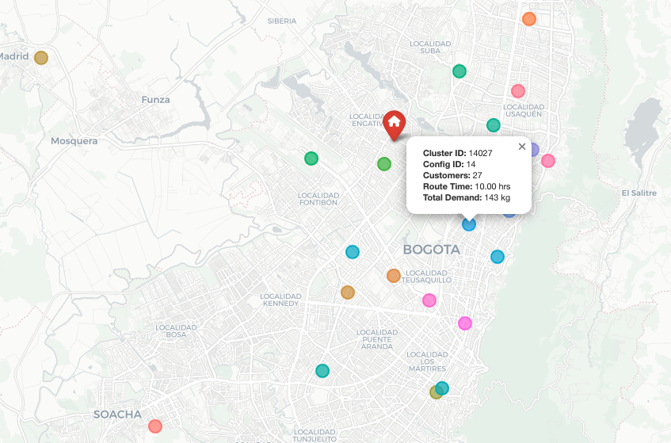
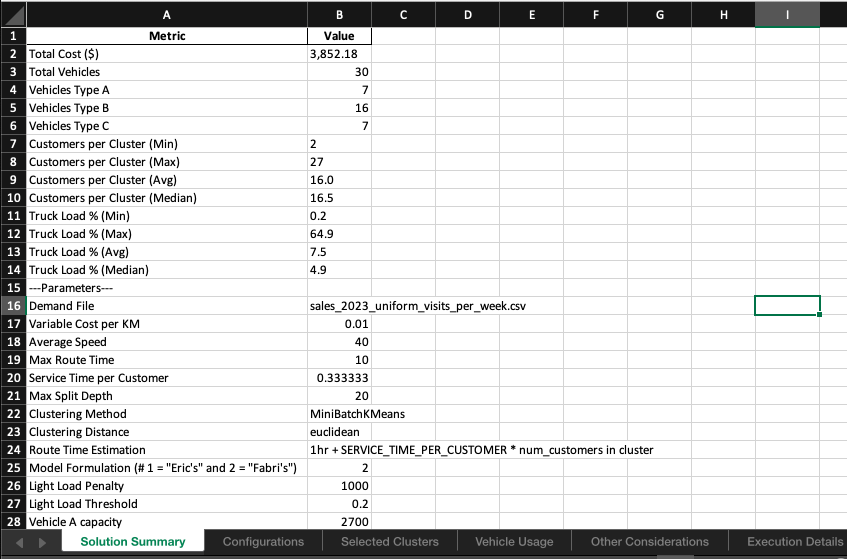

# MIT Fleet Design Optimization

The project implements a multi-step strategy to solve the Fleet Size and Mix (FSM) problem for Multi-Compartment Vehicles (MCVs). To test our solution appoach, we use case study data from a large food distribution company.

## Methodology

The optimization pipeline follows these steps:

1. Data Processing
   - Load customer demand data
   - Generate feasible vehicle configurations
   - Process geographic and demand constraints

2. Clustering
   - Group customers based on location and demand patterns
   - Consider vehicle capacities and time constraints
   - Use parallel processing for efficient cluster generation

3. Fleet Size and Mix Optimization
   - Minimize total cost (fixed + variable)
   - Ensure all customers are served
   - Respect vehicle and compartment capacities
   - Determine optimal number and type of vehicles
   - Apply compartment setup costs

4. Solution Validation and Results Export
   - Validate solution feasibility
   - Generate comprehensive reports

## Project Structure

```
mit-fleet-design-optimization/
├── data/
│   ├── export_avg_daily_demand.sql
│   ├── avg_daily_demand__2023_09.sql
│   ├── import.py                      # Creates a DB with sales data
│   ├── export_queries.py              # Generates csv files for each db query
│   └── sales_2023_create_data.sql
├── src/
│   ├── main.py                     # Principal execution script
│   ├── clustering.py               # Customer clustering implementation
│   ├── fsm_optimizer.py            # Fleet Size and Mix optimization
│   ├── clustering_playground.py    # Clustering experiments
│   ├── column_generation_playground.py
│   ├── config/
│   │   └── default_config.yaml    # Default configuration parameters
│   └── utils/
│       ├── data_processing.py
│       ├── logging.py
│       ├── save_results.py
│       └── vehicle_configurations.py
├── results/                       # Optimization results storage
│   ├── *.xlsx                 # Excel reports with detailed solution data
│   ├── *.json                 # JSON format results (if enabled in config)
│   └── *.html                 # Interactive cluster visualization maps
├── tests/
├── init.sh
├── requirements.txt
└── README.md
```

## Directory Structure Details

### Data Directory
The data directory contains utilities to process raw sales data into formats suitable for the optimization algorithm:

- `export_queries.py`: A module that handles SQL query execution and CSV exports. 
- `import.py`: Creates and populates a SQLite database (opperar.db) with sales data
- `sales_2023_create_data.sql`: SQL script to create and populate the sales database

### Source Directory (src/)
- `main.py`: Principal execution script that runs the complete optimization pipeline
- `clustering.py`: Implements customer clustering algorithms with capacity and time constraints
- `fsm_optimizer.py`: Fleet Size and Mix optimization using integer programming
- `clustering_playground.py`: Experimental clustering implementations
- `column_generation_playground.py`: Column generation algorithm experiments
- `config/`: Configuration files and parameters
- `utils/`: Helper modules for data processing, logging, and result management

### Results Directory
The results directory stores the output of each optimization execution:
- Excel files (.xlsx) containing:
  - Solution summary
  - Vehicle configurations
  - Selected clusters
  - Vehicle usage statistics
  - Other considerations
  - Execution details
- JSON files for programmatic access to the results

### Tests Directory
Contains test files for the project modules

### TODO
- Implement demand forecasting functionality
- Add forecasting models and results storage

## Requirements

### Installation Steps

1. Initialize the project environment:
```bash
./init.sh
```

This script will:
- Create a Python virtual environment
- Install required dependencies
- Create and populate the SQLite database with sales data from 2023
- Generate initial customer demand data files

2. Activate the Python environment:

For Mac/Linux:
```bash
source mit-fleet-env/bin/activate
```

For Windows:
```bash
mit-fleet-env\Scripts\activate
```

## Running the Optimization

To run the fleet optimization pipeline:
```bash
python src/main.py
```

### Command Line Options
The optimization can be customized using command line arguments:

```bash
# Show detailed parameter help
python src/main.py --help-params

# Use custom configuration
python src/main.py --config my_config.yaml

# Override specific parameters
python src/main.py --avg-speed 45 --max-route-time 12 --service-time 15

# Change clustering method and distance metric
python src/main.py --clustering-method agglomerative --clustering-distance composite --geo-weight 0.5 --demand-weight 0.5

# Combine all clustering methods at once
python src/main.py --clustering-method combine --verbose
```

#### Core Parameters
- `--avg-speed`: Average vehicle speed in km/h
- `--max-route-time`: Maximum route time in hours
- `--service-time`: Service time per customer in minutes
- `--route-time-estimation`: Method to estimate route times (Legacy, Clarke-Wright, BHH, CA, VRPSolver)
- `--light-load-penalty`: Penalty cost for light loads (0 to disable)
- `--light-load-threshold`: Threshold for light load penalty (0.0 to 1.0)
- `--compartment-setup-cost`: Cost per additional compartment beyond the first one

#### Clustering Options
- `--clustering-method`: Algorithm choice (minibatch_kmeans, kmedoids, agglomerative, combine)
- `--clustering-distance`: Distance metric (euclidean, composite)
- `--geo-weight`: Weight for geographical distance (0.0 to 1.0)
- `--demand-weight`: Weight for demand distance (0.0 to 1.0)

## Clustering Methods

The system supports several clustering methods to group customers efficiently:

### Basic Methods
- `minibatch_kmeans`: Fast K-means clustering based on geographical coordinates
- `kmedoids`: K-medoids clustering that's more robust to outliers
- `agglomerative`: Hierarchical clustering that can be customized to consider both geographical distance and demand similarity

### Combine Method
The `combine` method is a comprehensive approach that:
1. Runs multiple clustering algorithms:
   - MiniBatch K-means (geographical coordinates)
   - K-medoids (geographical coordinates)
   - Agglomerative clustering (with various weights for geographical distance and demand similarity)
2. Evaluates each cluster's feasibility based on:
   - Vehicle capacity constraints
   - Maximum route time
   - Product type compatibility
3. Selects the best clusters across all methods to create a final solution

This will generate and combine multiple clustering solutions to produce more robust results.

#### Input/Output
- `--demand-file`: Name of the demand file to use (must be in data directory)
- `--config`: Path to custom config file
- `--verbose`: Enable verbose output

## Route Time Estimation Methods

The system supports multiple methods for estimating route times:

1. **Legacy**: Simple estimation based on service time only
2. **Clarke-Wright**: Based on savings algorithm
3. **BHH**: Beardwood-Halton-Hammersley theorem approximation (Default)
4. **CA**: Continuous approximation method
5. **VRPSolver**: Detailed VRP solver-based estimation


## Visualization & Results Analysis

The optimization process generates several visualization and analysis outputs to help understand the solution:

### Interactive Maps
The solution generates interactive HTML maps using Folium that show:
- Customer locations colored by cluster assignment
- Depot location and service radius
- Cluster centroids and boundaries
- Vehicle type assignments
- Hover information showing:
  - Customer demands by product type
  - Route timing estimates
  - Vehicle capacity utilization

### Solution Analysis
Each optimization run produces detailed analysis in multiple formats:

#### Excel Reports (.xlsx)
Comprehensive solution details including:
- **Summary Metrics**
  - Total cost breakdown (fixed + variable)
  - Fleet composition
  - Service level metrics
  - Capacity utilization rates
- **Vehicle Analysis**
  - Configuration details
  - Usage statistics
  - Cost per vehicle type
- **Cluster Details**
  - Customer assignments
  - Demand aggregation
  - Route timing
  - Capacity constraints

#### JSON Output (Optional)
Machine-readable format containing:
- Complete solution data
- Performance metrics
- Configuration parameters
- Execution details

### Accessing Results
Results are stored in the `results/` directory:
```
results/
├── *.xlsx                 # Excel reports with detailed solution data
├── *.json                 # JSON format results (if enabled in config)
└── *.html                 # Interactive cluster visualization maps
```

To view the interactive map, open the generated HTML file in a web browser.

### Example Visualizations

#### Cluster Map

*Interactive map showing customer clusters and vehicle assignments*

#### Results Summary

*Detailed breakdown of solution metrics and performance*

## License

This project is licensed under the MIT License.